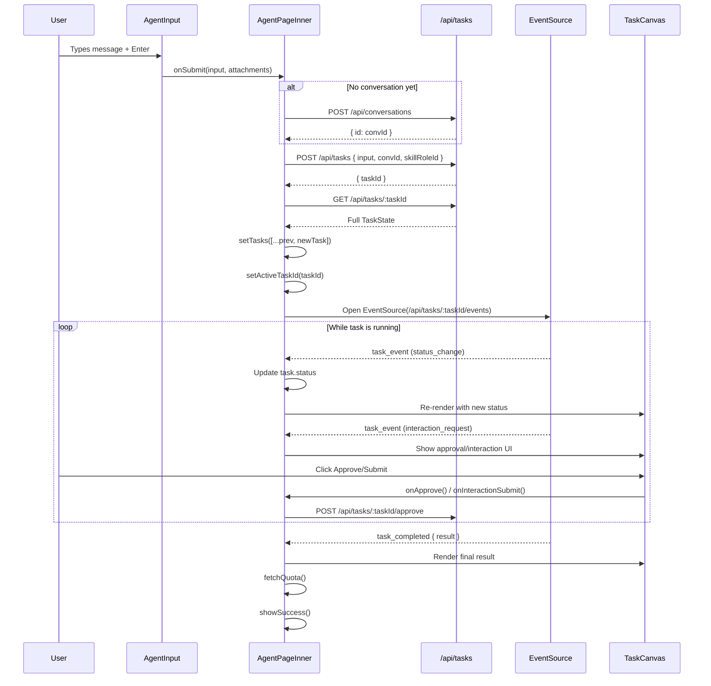

# Agent Page Audit — Rewrite Intelligence Report

Total codebase: **3,861 lines** across 10 files + 1 hook + 7 API endpoints.

---

## 1. Functional Module Breakdown

| Module | File | Lines | Core Responsibility |
|--------|------|-------|---------------------|
| **AgentPageInner** | page.tsx | 370–1112 (742) | Main orchestrator: state, effects, handlers, layout |
| **FirstTaskCoach** | page.tsx | 131–330 (199) | Onboarding banner for new users with zero history |
| **LiveStatusCycle** | page.tsx | 115–129 (14) | Rotating status text animation |
| **ActionIcon / SidebarIcon / CoachIcon** | page.tsx | 104–166 (62) | Inline SVG icon renderers |
| **groupByDate** | page.tsx | 333–354 (21) | Conversation date grouping utility |
| **parseTaskFromAPI** | page.tsx | 29–51 (22) | Raw API → TaskState transformer |
| **TaskCanvas** | TaskCanvas.tsx | 1–1112 (1112) | Task result rendering: steps, approvals, results, errors |
| **AgentInput** | AgentInput.tsx | 1–601 (601) | Composer: textarea, file upload, toolbar, skill picker |
| **SkillRolePicker** | SkillRolePicker.tsx | 1–434 (434) | Two-level AI colleague role selector |
| **SkillRoleMultiPicker** | SkillRoleMultiPicker.tsx | 1–225 (225) | Multi-select variant of role picker |
| **TaskList** | TaskList.tsx | 1–150 (150) | Compact task list display |
| **InteractionPanel** | InteractionPanel.tsx | 1–69 (69) | User interaction form (text input, yes/no, choice) |
| **Typewriter** | Typewriter.tsx | 1–70 (70) | Character-by-character text reveal animation |
| **WorkCard / WorkCardList** | WorkCard.tsx, WorkCardList.tsx | 1–80 (80) | Task card display (minimal usage) |
| **useSSE** | hooks/useSSE.ts | 1–75 (75) | EventSource wrapper with exponential backoff |

---

## 2. State Management Map

### useState in AgentPageInner (14 variables)

| Variable | Type | Scope | Shared? |
|----------|------|-------|---------|
| `authChecked` | boolean | Local | No |
| `conversations` | ConversationItem[] | Sidebar | Yes — sidebar + welcome |
| `currentConversationId` | string \| null | Global | Yes — URL, sidebar, tasks, input |
| `tasks` | TaskState[] | Conversation | Yes — canvas, input, SSE |
| `activeTaskId` | string \| null | Conversation | Yes — SSE, polling, canvas |
| `isSubmitting` | boolean | Input | Yes — input, welcome |
| `actionLoadingTaskId` | string \| null | Canvas | Yes — canvas buttons |
| `interactingTaskId` | string \| null | Canvas | Yes — canvas interaction |
| `errorToast` | string \| null | Global | No |
| `successToast` | string \| null | Global | No |
| `quota` | object \| null | Global | Yes — input, canvas |
| `sidebarOpen` | boolean | Local | No |
| `searchQuery` | string | Sidebar | No |
| `taskLoadError` | boolean | Conversation | No |
| `skillRoleId` | string \| null | Conversation | Yes — input, submit |

### useRef (4 refs)

| Ref | Purpose |
|-----|---------|
| `canvasEndRef` | Auto-scroll to bottom of messages |
| `scrollRef` | Scrollable message container |
| `activeRef` | Stable activeTaskId for SSE/polling callbacks |
| `currentConvRef` | Stable conversationId for polling guards |

### External Data Sources

| Source | Endpoint | Update Pattern |
|--------|----------|----------------|
| Conversations | GET /api/conversations | On mount + after task submit |
| Tasks | GET /api/conversations/:id/tasks | On conversation change |
| Active task | GET /api/tasks/:id | 2s polling while non-terminal |
| Task events | SSE /api/tasks/:id/events | Real-time via EventSource |
| Quota | GET /api/user | On mount + after submit |

### No global store (Zustand/Redux) — all state is local to AgentPageInner.

---

## 3. Data Flow Diagram

---

## 4. Risk Points

### useEffect Chain Complexity
- **11 useEffect hooks** in AgentPageInner, several with overlapping concerns
- URL sync (lines 412–451): 3 separate effects for URL ↔ state, including a manual popstate listener. Race condition if router.replace and pushState fire in quick succession.
- Polling effect (lines 523–542): uses `stopped` flag + ref checks to guard against stale closures. Fragile — a missed cleanup leaves zombie intervals.

### SSE Connection Management
- EventSource reconnects with exponential backoff (2s→15s max, 10 retries).
- **No dedup**: if user rapidly switches tasks, old SSE may fire events before cleanup runs.
- `onEventRef` pattern avoids stale closure but adds indirection.

### Race Conditions
- **Task submit → fetch → SSE**: after POST /api/tasks, immediately fetches task state AND opens SSE. If SSE replays events before the fetch returns, task state may be overwritten by stale fetch data.
- **Polling + SSE overlap**: 2s polling runs alongside SSE. Both update the same task in state. No merge logic — last write wins.

### Task State Machine
- Status transitions: pending → queued → understanding → structuring → interacting → executing → completed/failed
- `interacting` is a pause state that requires user input. If SSE delivers interaction_request while user is already responding to a previous one, the UI may flash.

### Non-standard DOM Operations
- `canvasEndRef.scrollIntoView({ behavior: 'smooth' })` fires on every render when activeTaskId exists (line 551–554, no dependency array filter).
- `window.history.pushState` used alongside `router.replace` — dual URL management.
- Inline styles with `onMouseEnter/onMouseLeave` for hover effects throughout sidebar and coach.

---

## 5. Reuse vs Rewrite vs Delete

### Reuse (swap UI, keep logic)
- `useSSE` hook — clean, well-structured, zero coupling to UI
- `parseTaskFromAPI` — pure function, no side effects
- `groupByDate` — pure utility
- API fetch functions (fetchConversations, fetchConversationTasks, fetchQuota)
- Task submission logic (handleSubmit, handleInteractionSubmit, handleApprove/Reject)
- `Typewriter` component — memo'd, self-contained

### Rewrite (logic and UI deeply coupled)
- **AgentPageInner** (742 lines) — must decompose into Sidebar, WelcomeView, ConversationView, InputArea
- **TaskCanvas** (1112 lines) — monolith rendering all result types; split into ResultRenderer, StepTimeline, ApprovalGate, ErrorCard
- **AgentInput** (601 lines) — file upload, skill picker, toolbar all inline; extract FileUpload, ComposerToolbar
- **SkillRolePicker** (434 lines) — functional but uses raw fetch + inline styles; wrap in design system

### Delete (dead code / debug remnants)
- `WorkCard.tsx` / `WorkCardList.tsx` (80 lines) — not imported by page.tsx, unused
- `SkillRoleMultiPicker.tsx` (225 lines) — not imported by page.tsx, unused
- `TaskList.tsx` (150 lines) — not imported by page.tsx, appears to be an older version
- Inline SVG icon components (ActionIcon, SidebarIcon, CoachIcon) — replace with lucide-react
- QUICK_ACTIONS / QUICK_NAV constants duplicating coach prompts

---

## 6. User-Facing Feature List

1. **Send a message** — type a prompt, press Enter, AI processes it
2. **Upload files** — attach files to a task via file picker
3. **View task progress** — real-time step-by-step execution timeline
4. **Approve/reject AI outputs** — approval gates for email, structure, proposals
5. **Respond to AI questions** — text input, yes/no, single choice interactions
6. **Request revisions** — adjust structure, adjust proposal, revise email
7. **View final results** — text, email preview, PPT, images, video
8. **Copy results** — copy button on result cards
9. **Retry failed tasks** — retry button on error cards
10. **Manage conversations** — create new, switch between, search history
11. **Select AI colleague** — skill role picker changes agent behavior
12. **View credit quota** — remaining credits shown in toolbar
13. **Quick actions** — 3 preset prompts for common tasks
14. **Navigate to other pages** — sidebar links to /tasks, /workspace, /account
15. **Onboarding coach** — first-time user guide with example prompts
16. **Unlock locked results** — pay credits to view premium results

---

## 7. Rewrite Recommendations

### Build Order (recommended sequence)

**Phase 1 — Shell + Sidebar (start here)**
- New `AppShell` using `Sidebar` + `PageShell` from product components
- Port conversation list, search, new chat, navigation links
- **Why first**: establishes the outer frame that everything else slots into. Low risk, high visibility.

**Phase 2 — Welcome / Task Launcher**
- Extract welcome screen into `WelcomeView` component
- Reuse quick actions and onboarding coach
- Wire up `AgentInput` (composer) in welcome mode
- **Why second**: self-contained, no SSE dependency, validates the shell works.

**Phase 3 — Conversation View (hardest)**
- `ConversationView` with message thread layout
- User bubble + AI response area
- Port `TaskCanvas` decomposed into sub-components:
  - `StepTimeline` — execution progress
  - `ApprovalGate` — approve/reject UI
  - `ResultRenderer` — polymorphic result display
  - `ErrorCard` — error + retry
- Wire SSE + polling + scroll management
- **Why hardest**: most state coupling, SSE race conditions, complex result types.

**Phase 4 — Input + Interactions (last)**
- Rebuild `AgentInput` with product design system
- Extract `FileUpload`, `ComposerToolbar` as separate components
- Port interaction handling (text input, choices, confirms)
- **Why last**: depends on conversation view being stable for the interaction flow to work.

### The single hardest part
**TaskCanvas.tsx** (1112 lines) — it renders 8+ different result types (text, email, PPT, image, video, proposal, structure, error), each with custom layouts, copy buttons, action buttons, and approval gates. The rendering logic is a giant switch statement with deeply nested conditionals. This is where most bugs will hide during rewrite.
