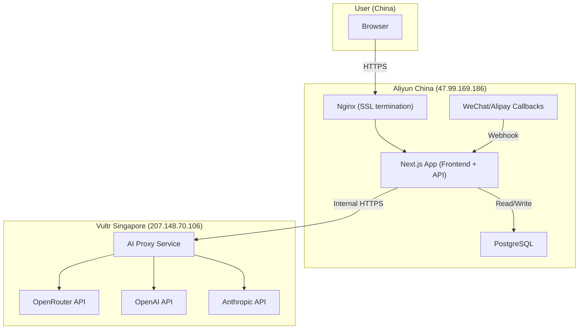

# OrangeBench Deployment Strategy

## 1. Current State

### Server Inventory

| Server | IP | Provider | Region | Role |
|---|---|---|---|---|
| Alibaba Cloud | 47.99.169.186 | Aliyun ECS | China (Hangzhou) | Frontend entry, ICP domain, WeChat/Alipay callbacks |
| Vultr SG | 207.148.70.106 | Vultr | Singapore | Can access international AI APIs |

### Current Request Path

```
User (China) → orangebench.tech (Aliyun, ICP filed)
  → Next.js SSR + API routes
  → POST /api/tasks → Worker → OpenRouter API (blocked from China IP)
```

### Environment Config

- `DATABASE_URL`: SQLite on local dev, Postgres on production (Aliyun)
- `OPENROUTER_API_KEY`: needs to be on a server with international IP access
- Payment callbacks (WeChat Pay, Alipay): must resolve to a China-based server with ICP filing

### Known Deployments

- **Aliyun**: Nginx reverse proxy → Next.js (PM2 or systemd), Postgres, payment webhook receiver
- **Vultr**: currently unused or minimal — available for AI proxy role
- **Local dev**: SQLite, no AI key (tasks stay at `queued`)

---

## 2. Problem Definition

### Contradiction 1: AI API Access

OpenAI, Anthropic (Claude), Google (Gemini), and OpenRouter all block or restrict requests from China mainland IP addresses. The Aliyun server at 47.99.169.186 (Hangzhou) cannot reliably call these APIs.

**Impact**: Tasks submitted through the Aliyun-hosted app cannot execute against international LLMs.

### Contradiction 2: Payment Infrastructure

WeChat Pay and Alipay require:
- Server hosted in China mainland
- Domain with valid ICP filing (orangebench.tech)
- Callback URLs resolving to a China IP

**Impact**: Payment processing cannot move to the Vultr Singapore server.

### Contradiction 3: Local Development

Developers in China cannot call OpenRouter/OpenAI from their local machines during development, making end-to-end testing impossible without a proxy or VPN.

**Impact**: Day 3+ development (SSE, task execution, result rendering) cannot be tested locally without infrastructure support.

---

## 3. Recommended Architecture: Layered Proxy



### Layer Responsibilities

| Layer | Server | Responsibility | IP Requirement |
|---|---|---|---|
| **Frontend + API** | Aliyun | SSR, auth, task CRUD, conversation management, payment, SSE streaming to client | China IP + ICP domain |
| **AI Proxy** | Vultr SG | Receives LLM requests from Aliyun, forwards to OpenRouter/OpenAI/Anthropic, returns responses | International IP |
| **Database** | Aliyun | PostgreSQL — user data, tasks, events, billing | Colocated with API |

### Internal Communication

```
Aliyun Worker → POST https://ai.orangebench.internal/v1/chat/completions
  Headers:
    X-OB-Internal-Key: <shared secret>
    X-OB-Task-Id: <task id for logging>
  Body: OpenAI-compatible chat completion request

Vultr AI Proxy → forwards to OpenRouter/OpenAI with real API key
  Returns: streamed or non-streamed completion response
```

**Security:**
- Internal key (`X-OB-Internal-Key`) shared between Aliyun and Vultr, never exposed to client
- Vultr only accepts requests with valid internal key
- `OPENROUTER_API_KEY` lives exclusively on Vultr, never on Aliyun
- Vultr does not serve any user-facing routes

### DNS Setup

| Domain | Points To | Purpose |
|---|---|---|
| `orangebench.tech` | 47.99.169.186 (Aliyun) | User-facing app, ICP filed |
| `ai.orangebench.internal` | 207.148.70.106 (Vultr) | Internal AI proxy (not public) |

---

## 4. Phased Rollout

### Phase 1: Tomorrow (Quick Validation)

**Goal**: Verify AI calls work from Vultr Singapore.

**Steps:**
1. Deploy full Next.js app to Vultr SG
2. Set `OPENROUTER_API_KEY` in Vultr `.env`
3. Set up SQLite or Postgres on Vultr
4. Point a temporary subdomain (e.g., `test.orangebench.tech`) to Vultr IP (no ICP needed for non-.cn subdomain, or use IP directly)
5. Test: submit task → worker calls OpenRouter → task completes → result renders

**Deliverables:**
- Confirmed AI call works from Singapore IP
- Full end-to-end flow validated (submit → SSE → result)
- Benchmark: typical task latency from China user to Vultr to OpenRouter

**Risks:**
- No ICP filing for Vultr domain — WeChat/Alipay won't work
- Latency: China → Singapore → OpenRouter → back may add 200-400ms
- Temporary only — not for production traffic

### Phase 2: One Week (Layered Architecture)

**Goal**: Production-ready dual-region setup.

**Steps:**
1. Build AI proxy service on Vultr:
   - Minimal Express/Fastify server (or Next.js API route)
   - Single endpoint: `POST /v1/chat/completions`
   - Validates `X-OB-Internal-Key`
   - Forwards to OpenRouter with real API key
   - Supports streaming (SSE passthrough)
2. Modify Aliyun worker (`src/lib/openrouter.ts`):
   - Change `LLM_GATEWAY_URL` from `https://openrouter.ai/api/v1/chat/completions` to `https://ai.orangebench.internal/v1/chat/completions`
   - Add internal auth header
3. Payment stays on Aliyun (no change)
4. SSL cert for `ai.orangebench.internal` (Let's Encrypt or self-signed with pinning)
5. Firewall: Vultr only accepts traffic from Aliyun IP

**Deliverables:**
- Aliyun handles all user traffic + payment
- Vultr handles all AI API calls
- `OPENROUTER_API_KEY` never touches Aliyun
- Latency: user → Aliyun (fast) → Vultr (AI, ~200ms hop) → back

### Phase 3: One Month (Resilience + China Models)

**Goal**: Multi-model fallback, China-native option.

**Steps:**
1. Add DeepSeek and Qwen (Tongyi Qianwen) as LLM backends:
   - These can be called directly from Aliyun (no proxy needed)
   - Worker routing: if model is DeepSeek/Qwen → call directly; if OpenAI/Claude → proxy via Vultr
2. User setting: "Use China-native models only"
   - Bypasses Vultr entirely
   - Lower latency, no international dependency
   - May have different capability profile
3. Fallback chain:
   ```
   Primary: OpenRouter (via Vultr)
   Fallback 1: DeepSeek (direct from Aliyun)
   Fallback 2: Qwen (direct from Aliyun)
   ```
4. Health monitoring:
   - Vultr AI proxy health check every 30s
   - If Vultr is down → auto-switch to DeepSeek
   - Alert via DingTalk/Feishu webhook

**Deliverables:**
- Users can choose between international and domestic models
- System auto-falls back to Chinese models if international path fails
- Zero dependency on international infrastructure for basic functionality

### Local Development Solution

For developers in China who can't access OpenRouter:

**Option A (Recommended)**: SSH tunnel to Vultr
```bash
ssh -L 8080:localhost:8080 root@207.148.70.106
# Set LLM_GATEWAY_URL=http://localhost:8080/v1/chat/completions in .env.local
```

**Option B**: Use DeepSeek API (accessible from China)
```bash
# .env.local
LLM_GATEWAY_URL=https://api.deepseek.com/v1/chat/completions
OPENROUTER_API_KEY=sk-deepseek-xxx  # DeepSeek API key
```

**Option C**: Mock mode (current)
- Tasks submit successfully but stay at `queued`
- UI development and testing works without any AI key
- SSE/polling infrastructure can be tested with manual DB event injection
